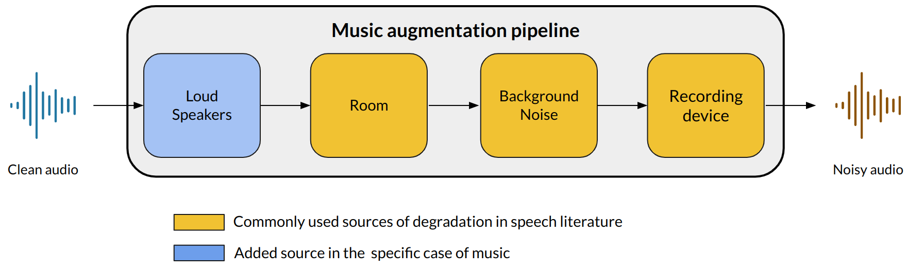
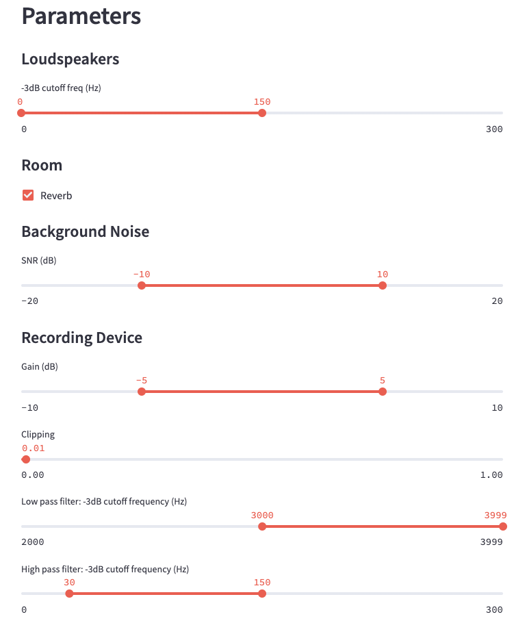
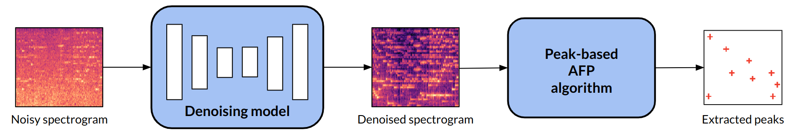

# Music Augmentation and Denoising For Peak-Based Audio Fingerprinting

This repository provides the code to reproduce the paper:  

```
@article{akesbi2023music,
  title={Music Augmentation and Denoising For Peak-Based Audio Fingerprinting},
  author={Akesbi, Kamil and Desblancs, Dorian and Martin, Benjamin},
  journal={arXiv preprint arXiv:2310.13388},
  year={2023}
}
``````
which can be found [here](https://arxiv.org/abs/2310.13388).

This work is going to be presented at the Late-Breaking Demo Session of ISMIR 2023.

## Setup

### Datasets

In order to use the music augmentation pipeline, you will need to download the following datasets: 

### Room Impulse Responses

We use the MIT impulse response (IR) survey dataset. You can download the dataset [here](https://mcdermottlab.mit.edu/Reverb/IR_Survey.html).

### Background Noise

We build our own background noise dataset by mixing samples from past [Acoustic scence datasets from the DCASE challenge](https://dcase-repo.github.io/dcase_datalist/datasets_scenes.html). We select: 

- The TUT Acoustic scenes 2017. Development [here](https://zenodo.org/records/400515) and evaluation dataset [here](https://zenodo.org/records/1040168). 
- The TUT Urban Acoustic Scenes 2018 Mobile. Development dataset [here](https://zenodo.org/records/1228235), and evaluation dataset [here](https://zenodo.org/records/1293901). 
- The 2020 TAU Urban Acoustic Scenes 2020 Mobile challenge. Development dataset [here](https://zenodo.org/records/3819968), and evaluation dataset [here](https://zenodo.org/records/3685828).

### Music Dataset

We use the MTG-Jamendo dataset to train different music denoising models. Download the dataset [here](https://mtg.github.io/mtg-jamendo-dataset/). 

### Audio Fingerprinting Dataset

We use the Free Music Archive (FMA) Large as our reference database to evaluate the performances of Audio Fingerprinting systems to noisy query snipets.
Download the dataset [here](https://github.com/mdeff/fma). 

## Running some Code 

You can specify the path to the datasets folders in `docker/install/.env`.

From there, you can build and launch your Docker environment for experiments using the following commands:
```
docker-compose -f docker/install/docker-compose.yaml build
docker-compose -f docker/install/docker-compose.yaml up -d
docker-compose -f docker/install/docker-compose.yaml run python /bin/bash
```
Your code will then use the following structure:
```
workspace/ 
    src/
    noise_databases/
        mit_ir_survey/
        dcase/
            tut_2017_development/
            tut_2017_evaluation/
            tut_2018_development_mobile/
            tut_2018_evaluation_mobile/
            tut_2020_development_mobile/
            tut_2020_evaluation_mobile/
    fma/
    mtg-jamendo-dataset/
    queries/
```
You can then install the dependencies needed using [poetry](https://python-poetry.org/):
```
cd src/
poetry install 
poetry shell
poetry run python ...
```

## Music Augmentation Pipeline: 



The augmentation pipeline is composed of several transformations applied to an audio input. It is designed to reproduce degradations caused by room responses, background noise, recording devices and loud speakers. 

### Augmented Audios Generation

To generate an augmented music recording from a clean music snipet, you can use the following script: 
``` python
from augmentation import AugmentFP
from training.parameters import WAVEFORM_SAMPLING_RATE, DURATION

af = AugmentFP(List[noise_paths], WAVEFORM_SAMPLING_RATE)

waveform, sr = torchaudio.load("path_to_audio")
waveform = waveform.mean(axis=0)
waveform = torchaudio.transforms.Resample(sr, WAVEFORM_SAMPLING_RATE)(waveform)

nb_samples_segment = WAVEFORM_SAMPLING_RATE * DURATION
start = random.randint(0, waveform.shape[0] - nb_samples_segment)
waveform = waveform[start : start + nb_samples_segment].unsqueeze(0)

aug = af(waveform)
```

### Streamlit integration: 

The pipeline and its different parameters can also be tested in a user-friendly interface using streamlit. The script to access the streamlit interface is:
```
streamlit run streamlit_app/app.py --server.port=8501 --server.address=0.0.0.0 --server.fileWatcherType=None
```
which results in an interface that looks like...



## Experiments



### Music Denoising

To train the models (UNet on magnitude spectrograms or Demucs on raw audio waveforms): 

```
python -m training.train --model=unet
```
In order to visualize the tensorboard logs: 
```
tensorboard --logdir=monitoring/ --port=6006
```
Model weights of two pretrained models can be found in the following Google Drive: https://drive.google.com/file/d/1wAV5EP3oh-V-Q3k-Qf6BEdJjQjZATZJ4/view?usp=sharing. 

In particular, we provide the pretrained weights of: 

- A UNet trained to denoise magnitude spectrograms of 8kHz audio signals. 
- A Demucs trained to denoise 8 kHz raw audio waveforms.  

Use the models to generate audios and spectrograms:
```
python -m training.generate_audios --model=unet
```

## Audio Fingerprinting

We evaluate the robustness of AFP systems to the distortions our augmentation pipeline generates. We use two popular open-source systems: [Audfprint](https://github.com/dpwe/audfprint) and [Dejavu](https://github.com/worldveil/dejavu).

We use the FMA large dataset as our reference database. To preprocess it, use: 
```
python testing/fma_preprocessing.py
```
We can then generate 10000 eight-second audio queries using: 
```
python -m testing.generate_queries --queries=cleans
python -m testing.generate_queries --queries=augmented
```

### Audfprint:

To index the FMA large on Audfprint, use: 
```
python -m testing.audfpring_exps --action=index
```
To obtain results on Audfprint (specify demucs or unet model):
```
python -m testing.audfpring_exps --action=identification_rate --model=unet
python -m testing.audfpring_exps --action=peaks_metrics --model=unet
```

### Dejavu: 

To index the FMA large on Dejavu, use: 
```
python -m testing.dejavu_exps --action=index
```
To obtain results on Dejavu (specify demucs or unet model):
```
python -m testing.dejavu_exps --action=identification_rate --model=unet
python -m testing.dejavu_exps --action=peaks_metrics --model=unet 
```
